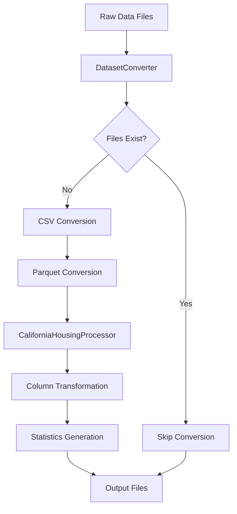

# Project Structure 📁

This document describes the organization and architecture of the PolarLearning project.

## 🏗️ Directory Structure

```
polarlearning/
├── 📂 src/                          # Source code
│   ├── 📄 main.rs                   # Application entry point
│   ├── 📄 dataset_converter.rs     # Generic dataset conversion logic
│   └── 📄 california_housing.rs    # California Housing specific processing
├── 📂 datasets/                     # Raw input datasets
│   └── 📂 CaliforniaHousing/
│       ├── 📄 cal_housing.data     # Raw data file (2MB)
│       └── 📄 cal_housing.domain   # Domain/schema file
├── 📂 model-input-data/             # Processed output datasets
│   ├── 📂 processed/                # Future: processed datasets
│   └── 📂 raw/                      # Converted datasets
│       ├── 📄 CaliforniaHousing.csv     # Clean CSV (1.2MB)
│       └── 📄 CaliforniaHousing.parquet # Optimized Parquet (375KB)
├── 📂 models/                       # Future: trained ML models
├── 📂 outputs/                      # Future: model outputs/predictions
├── 📂 target/                       # Rust build artifacts
│   └── 📂 release/
│       └── 📄 polarlearning         # Compiled executable (50MB)
├── 📄 Dockerfile                    # Container definition
├── 📄 build_fast.ps1               # Development build script
├── 📄 dev_shell.ps1                # Development shell script
├── 📄 Cargo.toml                   # Rust dependencies
├── 📄 Cargo.lock                   # Dependency lock file
└── 📄 README.md                    # Project documentation
```

## 🧩 Code Architecture

### Core Components

#### 1. **Main Application** (`src/main.rs`)
- **Purpose**: Application entry point and orchestration
- **Responsibilities**:
  - Define input/output paths
  - Control verbosity levels
  - Coordinate dataset conversion
  - Handle error propagation

```rust
#[tokio::main]
async fn main() -> Result<()> {
    let verbosity = Verbosity::Normal; // or Silent
    
    // Dataset conversion pipeline
    let output_path = DatasetConverter::convert_if_needed(
        "CaliforniaHousing",
        data_file_path,
        domain_file_path,
        verbosity,
    ).await?;
    
    // Domain-specific transformations
    CaliforniaHousingProcessor::transform_columns(df)?;
}
```

#### 2. **Dataset Converter** (`src/dataset_converter.rs`)
- **Purpose**: Generic dataset conversion engine
- **Responsibilities**:
  - File existence validation
  - Output directory management
  - CSV/Parquet generation
  - Caching logic (skip if exists)
  - Statistics generation

```rust
pub struct DatasetConverter;

impl DatasetConverter {
    pub async fn convert_if_needed(
        dataset_name: &str,
        data_file_path: &str,
        domain_file_path: &str,
        verbosity: Verbosity,
    ) -> Result<String>
}
```

#### 3. **Domain Processor** (`src/california_housing.rs`)
- **Purpose**: California Housing dataset specific logic
- **Responsibilities**:
  - Column name mapping
  - Data type transformations
  - Domain-specific statistics
  - Feature engineering

```rust
pub struct CaliforniaHousingProcessor;

impl CaliforniaHousingProcessor {
    pub fn transform_columns(df: LazyFrame) -> Result<DataFrame>
    pub fn print_statistics(df: &DataFrame, verbosity: Verbosity) -> Result<()>
}
```

## 🔄 Data Flow



## 🐳 Docker Architecture

### Image Layers
1. **Base Layer**: NVIDIA CUDA Ubuntu 22.04
2. **System Dependencies**: Rust toolchain, build tools
3. **Dependency Cache**: Pre-compiled Rust dependencies
4. **Application Code**: Source code and final compilation
5. **Runtime**: Executable with default CMD

### Volume Strategy
- **Development**: Source code and build cache mounted
- **Production**: Self-contained with no external dependencies

## 📊 Data Schemas

### Input Schema (Raw Data)
```
column_1: f64    # Longitude
column_2: f64    # Latitude  
column_3: f64    # Housing median age
column_4: f64    # Total rooms
column_5: f64    # Total bedrooms
column_6: f64    # Population
column_7: f64    # Households
column_8: f64    # Median income
column_9: f64    # Median house value
```

### Output Schema (Processed Data)
```
longitude: f64              # Geographic coordinate
latitude: f64               # Geographic coordinate
housing_median_age: f64     # Age of housing in years
total_rooms: f64            # Total number of rooms
total_bedrooms: f64         # Total number of bedrooms
population: f64             # Population in the area
households: f64             # Number of households
median_income: f64          # Median income (tens of thousands)
median_house_value: f64     # Median house value (target variable)
```

## 🚀 Extensibility Points

### Adding New Datasets
1. Create new processor in `src/`
2. Implement `transform_columns()` method
3. Add dataset-specific statistics
4. Update main.rs to use new processor

### Adding New Output Formats
1. Extend `DatasetConverter` with new format methods
2. Add format-specific dependencies to `Cargo.toml`
3. Update conversion pipeline

### Adding ML Models
1. Create `src/models/` module
2. Add training pipeline
3. Implement inference endpoints
4. Extend Docker for model serving

## 🔧 Configuration Files

### Cargo.toml
- **Dependencies**: Polars, Anyhow, Tokio
- **Features**: Lazy evaluation, CSV/Parquet support
- **Optimization**: Release profile settings

### Dockerfile
- **Multi-stage**: Dependency caching optimization
- **CUDA Support**: GPU acceleration ready
- **Security**: Non-root user setup
- **Size**: Optimized layer structure

---

This structure provides a solid foundation for scaling the project into a full ML pipeline with additional datasets, models, and deployment targets.
